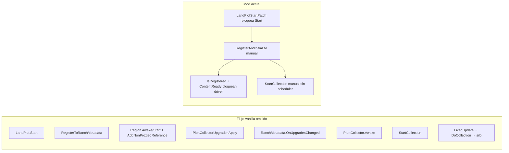

# Plan: Recolector vanilla real + eliminar holograma azul (v1.7.0)

> **Para otra IA / implementador:** Este documento describe el trabajo pendiente tras v1.6.3.
> Estado del mod al crear este plan: recolector no aspira, sin FX/animación, plorts levitan, overlay azul iridiscente persiste.
> Juego: Slime Rancher 2 v1.2.3 + MelonLoader. DLL del juego: `C:\Games\Slime Rancher 2\MelonLoader\Il2CppAssemblies\Assembly-CSharp.dll`

## Todos (checklist)

- [ ] **dnspy-decompile** — Decompilar con dnSpy los 7 tipos clave y documentar pseudocódigo en `PLORT_COLLECTOR_DUMP.md`
- [ ] **region-proxy-fix** — Crear `RegionProxyHelper`: `AddNonProxiedReference`, destruir proxy, asignar `lp._region` propia
- [ ] **vanilla-register** — Reordenar `LandPlotStartPatch` / `RegisterAndInitialize`: `RegisterToRanchMetadata` → Unproxy → Apply → `OnUpgradesChanged`
- [ ] **collector-cycle** — Patch `FixedUpdate` + restaurar `Activate` vanilla + `SiloStorage.InitAmmo` estricto + quitar compuertas del driver
- [ ] **debug-logging** — Activar logging diagnóstico (`MelonPreferences`) para inMeta/region/storage/joints
- [ ] **ingame-test** — Probar corral nuevo + reload: sin azul, FX, silo, botón manual

---

## Diagnóstico (por qué v1.6.3 sigue roto)

La imagen muestra **overlay iridiscente en corral y vacpack**, plort **levitando sin FX** y collector **sin animación de aspirado**. Cruzando dumps (`ModProject/ApiCheck/plort_dump.txt`, `ModProject/ApiCheck/plort_dump2.txt`) con el código del mod:



### Causa raíz más probable (textura azul)

En `plort_dump2.txt`, `Il2CppMonomiPark.SlimeRancher.Regions.Region` tiene:
- `ProxyMaterials`, `_proxyObj`, `CreateProxy`, `Proxy`, `Unproxy`
- `AddNonProxiedReference` / `RemoveNonProxiedReference`

Eso es exactamente el **holograma de plot vacío/proxy**. Al bloquear `LandPlot.Start` en `Patches/LandPlotStartPatch.cs`, el plot custom **nunca sale del modo proxy** → mesh holográfico visible (y si escala mal, cubre toda la escena incluyendo vacpack).

### Causa raíz más probable (recolector)

El mod **reimplementa a medias** el pipeline documentado en `VANILLA_CORRAL_FLOW.md` y `PLORT_COLLECTOR_DUMP.md`:

| Requisito vanilla | Estado actual | Síntoma |
|---|---|---|
| `RegisterToRanchMetadata` crea `_region` + registro en `RegionRegistry` | Reflexión + fallback manual; puede fallar (`inMeta=False` documentado) | Collector sin ciclo automático |
| `Region` propia del plot (no vecino) | Fallback `EnsureRegionFromNeighbor` en `CorralRegistrationHelper.cs` | `DoCollection` no encuentra plorts |
| `PlortCollector.Awake` con `_region`, `_storage`, `_joints` listos | `InvokeVanillaAwake` pero a veces **antes** de región | Refs null |
| `SiloStorage.InitModel` + **`InitAmmo`** | Añadido en v1.6.3 pero puede correr antes de `Apply` | Plorts levitan, no entran al silo |
| `FixedUpdate` llama `DoCollection` internamente | Driver solo llama `StartCollection`; **nunca garantiza `DoCollection`** | Sin joints / sin FX |
| `PlortCollectorActivator.Activate` vanilla | Prefix devuelve `false` (reemplaza vanilla) | Botón sin feedback real |
| `ContentReady` + `IsRegistered` | Driver en `PlortCollectorDriver.cs` **no procesa** plots no registrados | Recolección nunca arranca |

Los logs no muestran errores porque `Warn`/`LogWireStatus` están vacíos en `CorralRegistrationHelper.cs` — el mod falla en silencio.

---

## Fase 0 — Decompilar con dnSpy (obligatoria antes de codificar)

Abrir `C:\Games\Slime Rancher 2\MelonLoader\Il2CppAssemblies\Assembly-CSharp.dll` y extraer pseudocódigo de:

| Tipo | Métodos |
|---|---|
| `LandPlot` | `Start`, `RegisterToRanchMetadata` (privado) |
| `Il2CppMonomiPark.SlimeRancher.Regions.Region` | `Awake`, `Start`, `AddNonProxiedReference`, `CreateProxy`, `Unproxy` |
| `PlortCollectorUpgrader` | `Apply`, `OnInitialPurchase` |
| `PlortCollector` | `Awake`, `InitModel`, `StartCollection`, `DoCollection`, `FixedUpdate` |
| `PlortCollectorActivator` | `Awake`, `Activate` |
| `SiloStorage` | `Awake`, `InitModel`, `InitAmmo`, `MaybeAddToAnySlot` |
| `RanchMetadata` | `Register(LandPlot)`, `OnUpgradesChanged` |

**Entregable:** ampliar `PLORT_COLLECTOR_DUMP.md` con el pseudocódigo real (condiciones exactas de `_endCollectAt`, cuándo se llama `DoCollection`, qué hace `RegisterToRanchMetadata` con `Region`).

**Alternativa en repo:** extender `ModProject/ApiCheck/PlortDump.cs` con un modo runtime que, estando en rancho, loguee en `Latest.log` el estado del collector del plot más cercano (`_region`, `_storage`, `_joints.Count`, `_endCollectAt`, `CollectionArea.CurrColliders().Count`, `silo.Ammo`).

---

## Fase 1 — Arreglar Region / holograma azul (prioridad alta)

Nuevo helper `RegionProxyHelper.cs`:

1. Tras spawn/replace en `RealPlotFactory.cs`, buscar `Region` en hijos del `LandPlot`.
2. Asignar **`lp._region = regionDelPlot`** (nunca vecino salvo que el prefab no tenga Region).
3. Replicar lo que hace vanilla post-construcción:
   - Llamar `region.AddNonProxiedReference()` (evita proxy holográfico)
   - Destruir/desactivar `region.GetProxyObj()` / `_proxyObj` si existe
   - Invocar `region.Awake()` + `region.Start()` si no corrieron
4. Integrar en `RegisterAndInitialize` **antes** de `Apply` upgrades.
5. **Eliminar o relegar** `EnsureRegionFromNeighbor` a último recurso (solo si prefab no trae Region).

Esto debe quitar la cuadrícula iridiscente del corral y reducir overlays globales causados por proxy gigante.

---

## Fase 2 — Rehacer registro LandPlot (paridad vanilla)

Cambiar estrategia en `Patches/LandPlotStartPatch.cs`:

**Opción preferida (menos invasiva):**
- Prefix: asegurar `InitModel` + `InitializeLandPlotModel` (como ahora).
- **Postfix diferido:** llamar secuencia vanilla en orden estricto:

```
InitModel(model)
→ RegisterToRanchMetadata()   // reflexión, debe crear _region
→ RegionProxyHelper.Unproxy(plot)
→ UpgradeActivationHelper (Apply)
→ RanchMetadata.OnUpgradesChanged
→ WirePlortCollector (sin StartCollection manual todavía)
```

**No marcar `_done`** hasta verificar:
- `lp._region != null` y es hijo del plot
- `pc._storage != null` y `silo.GetRelevantAmmo() != null` (post-InitAmmo)
- `IsInMetadata(rm, lp) == true`

Activar logging real (MelonPreferences `DebugCorralRegistration`) en `Warn`/`LogWireStatus` para ver en log por qué falla cada plot.

---

## Fase 3 — Recolector: dejar correr el ciclo vanilla

### 3a. Dejar de bloquear el driver

En `PlortCollectorDriver.cs`:
- Quitar compuerta `ContentReady` (o marcar `ContentReady` en cuanto exista `LandPlot`, no solo tras metadata).
- Quitar `continue` cuando `!IsRegistered` — cablear y mantener aunque metadata falle.
- Llamar `WirePlotComponents` + `EnsureCollectorSiloReady` siempre.

### 3b. No reemplazar Activate vanilla

En `Patches/PlortCollectorActivatorPatch.cs`:
- **Prefix solo cablea** (`WireSingleActivator`, `Collector = pc`, silo listo).
- **`return true`** para que `Activate()` vanilla ejecute animación, `PressButtonCue`, `_forceCollectUntil`, `StartCollection`.

### 3c. Harmony Postfix en `PlortCollector.FixedUpdate` (seguro)

Nuevo patch basado en pseudocódigo dnSpy:
- Si plot es nuestro y ventana activa (`now < _endCollectAt || now < _forceCollectUntil`):
  - Verificar refs; si `_joints` vacío y hay colliders en `CollectionArea`, invocar **`DoCollection()`** (reflexión si hace falta — ya expuesto en interop).
  - Si joint cerca de `CollectPt` y `MaybeAddToAnySlot` falla → log + reintentar `InitAmmo`.
- Si ventana expirada → limpiar joints huérfanos (evita levitación permanente).

### 3d. SiloStorage — orden estricto

En `WireSiloStorage` (`CorralRegistrationHelper.cs`):

```
Awake → InitModel(model) → SetModel(model) → InitAmmo → verificar AmmoSetReference
```

Solo entonces asignar `pc._storage = silo` y llamar **una vez** `StartCollection()` (vía `EnsureCollectorRunning`, sin spam).

### 3e. Reducir StartCollection manual

Según `VANILLA_CORRAL_FLOW.md`: evitar doble registro en RanchMetadata. Confiar en `OnUpgradesChanged` + postfix de FixedUpdate; reservar `PulseCollection`/`DoCollection` solo para botón manual.

---

## Fase 4 — Validación in-game

Checklist tras compilar **v1.7.0**:

1. Colocar corral nuevo → **sin overlay azul** en corral ni vacpack.
2. Comprar Plort Collector → botón hace **anim + sonido**.
3. Dejar plorts en corral → **FX ciclón + sonido vac** + plorts entran al **silo del collector** (no levitan).
4. Guardar/salir/cargar → collector sigue funcionando.
5. Log con debug ON muestra: `inMeta=True`, `region=own`, `storage=ok`, `ammo=ok`, `colliders=N`.

---

## Archivos principales a tocar

| Archivo | Acción |
|---|---|
| `Patches/LandPlotStartPatch.cs` | Registro vanilla parcial |
| `Placement/CorralRegistrationHelper.cs` | Región, silo, logging, quitar neighbor-first |
| `Placement/PlortCollectorHelper.cs` | Simplificar; quitar PulseCollection agresivo |
| `Placement/PlortCollectorDriver.cs` | Sin compuertas duras |
| `Patches/PlortCollectorActivatorPatch.cs` | Dejar correr vanilla (`return true`) |
| **Nuevo** `Placement/RegionProxyHelper.cs` | Quitar holograma proxy |
| **Nuevo** `Patches/PlortCollectorFixedUpdatePatch.cs` | Garantizar DoCollection + cleanup joints |
| `Placement/PLORT_COLLECTOR_DUMP.md` | Pseudocódigo dnSpy |
| `ModEntry.cs` | Versión 1.7.0 + pref debug |

---

## Contexto adicional del repo

- Documentación existente: `VANILLA_CORRAL_FLOW.md`, `PLORT_COLLECTOR_DUMP.md`
- Dumps API: `ModProject/ApiCheck/plort_dump.txt`, `plort_dump2.txt`
- Versión actual compilada: **1.6.3** (`ModEntry.cs`, `ModPackManager.cs`)
- Problemas previos del usuario: plorts chupan un rato pero no entran al silo, levitan después, botón no hace nada, textura azul en toda la escena
